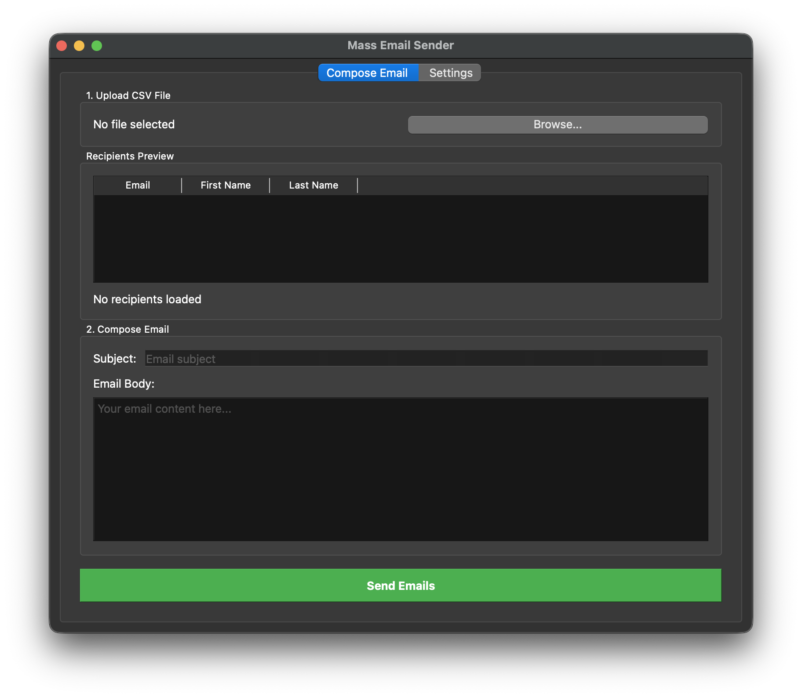
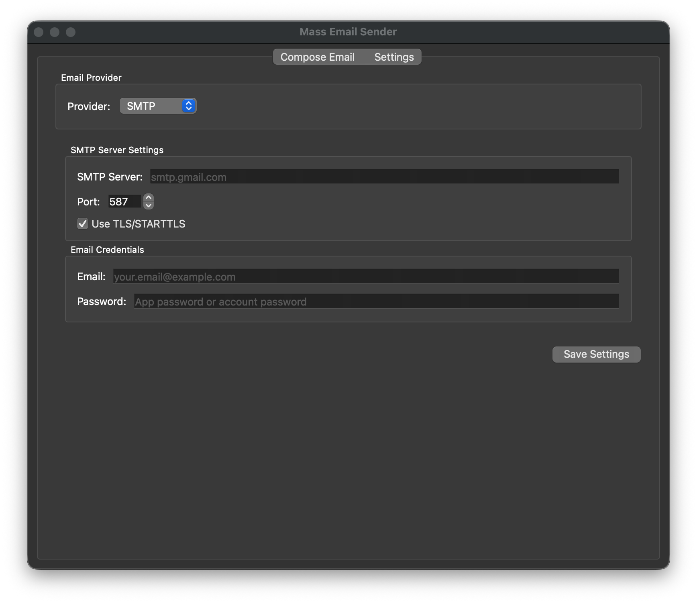
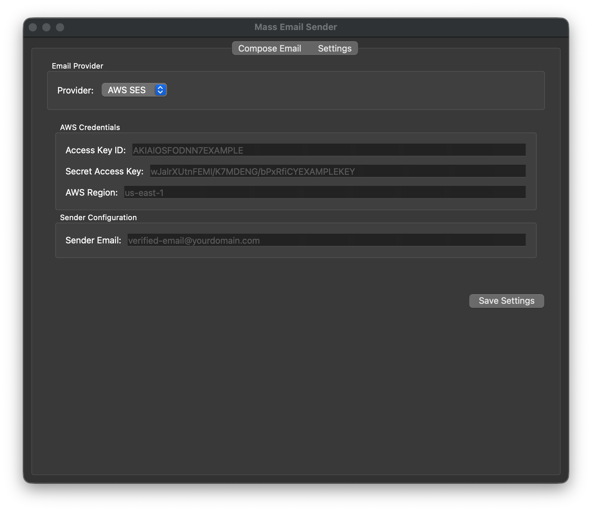

# Mass Email Sender

A PyQt6 desktop application for sending personalized mass emails with CSV file support.

## Screenshots

### Main Window


### Settings Window



## Features

- 📧 **CSV Import**: Upload CSV files with recipient information
- 📝 **Template Variables**: Personalize emails with `{first_name}`, `{last_name}`, and `{email}`
- ⚙️ **Multiple Email Providers**: Choose between SMTP or AWS SES
- 🔧 **SMTP Configuration**: Configurable email server settings (Gmail, Outlook, etc.)
- ☁️ **AWS SES Support**: Send emails via Amazon Simple Email Service
- 📊 **Progress Tracking**: Real-time progress bar during email sending
- 👀 **Preview**: See recipients before sending
- 💾 **Settings Persistence**: Save settings for reuse

## Installation

1. Install required packages:
```bash
pip install PyQt6 polars boto3
```

2. Run the application:
```bash
python main.py
```

**Note**: `boto3` is only required if you plan to use AWS SES.

## Usage

### 1. Configure Email Settings

Go to the **Settings** tab and select your email provider:

#### Option A: SMTP (Gmail, Outlook, etc.)

1. Select **SMTP** from the Provider dropdown
2. Enter your SMTP credentials:
   - **SMTP Server**: Your email provider's SMTP server
     - Gmail: `smtp.gmail.com`
     - Outlook: `smtp-mail.outlook.com`
     - Yahoo: `smtp.mail.yahoo.com`
   - **Port**: Usually 587 for TLS or 465 for SSL
   - **Email**: Your email address
   - **Password**: Your email password or app-specific password

**Important for Gmail users:**

- Enable 2-factor authentication
- Create an [App Password](https://myaccount.google.com/apppasswords)
- Use the app password instead of your regular password

#### Option B: AWS SES

1. Select **AWS SES** from the Provider dropdown
2. Enter your AWS credentials:
   - **Access Key ID**: Your AWS access key
   - **Secret Access Key**: Your AWS secret key
   - **AWS Region**: The SES region (e.g., `us-east-1`)
   - **Sender Email**: A verified email address in SES

**Important for AWS SES users:**

- Your sender email must be verified in AWS SES
- If in sandbox mode, recipient emails must also be verified
- Request production access for unrestricted sending

Click **Save Settings** to persist your configuration.

### 2. Prepare CSV File

Create a CSV file with these required columns:
- `email` - Recipient email address
- `first_name` - Recipient's first name
- `last_name` - Recipient's last name

Example (`sample_recipients.csv` included):
```csv
email,first_name,last_name
john.doe@example.com,John,Doe
jane.smith@example.com,Jane,Smith
```

### 3. Compose Email

1. Click **Browse...** to upload your CSV file
2. Review the recipients preview table
3. Enter email **Subject**
4. Write your email body using template variables:

```
Dear {first_name} {last_name},

This is a personalized email sent to {email}.

Best regards,
Your Name
```

Available variables:
- `{first_name}` - Replaced with recipient's first name
- `{last_name}` - Replaced with recipient's last name
- `{email}` - Replaced with recipient's email

### 4. Send Emails

1. Click **Send Emails**
2. Confirm the number of recipients
3. Watch the progress bar as emails are sent
4. Get a success/failure notification when complete

## CSV File Requirements

The CSV file must contain these columns (case-insensitive):
- `email` or `e-mail`
- `first_name` or `firstname` or `first name`
- `last_name` or `lastname` or `last name`

The application will automatically detect column names and validate email addresses.

## SMTP Server Examples

### Gmail
- **Server**: `smtp.gmail.com`
- **Port**: 587
- **TLS**: Yes
- **Note**: Use App Password with 2FA enabled

### Outlook/Hotmail
- **Server**: `smtp-mail.outlook.com`
- **Port**: 587
- **TLS**: Yes

### Yahoo Mail
- **Server**: `smtp.mail.yahoo.com`
- **Port**: 587
- **TLS**: Yes
- **Note**: Generate app password in settings

### Custom SMTP
Configure your own SMTP server with appropriate credentials.

## AWS SES Configuration

### Prerequisites

1. An AWS account with SES enabled
2. IAM user with SES permissions (`ses:SendEmail`, `ses:SendRawEmail`)
3. Verified sender email address or domain

### Setup Steps

1. **Create IAM User**:
   - Go to AWS IAM Console
   - Create a new user with programmatic access
   - Attach `AmazonSESFullAccess` policy (or custom policy with send permissions)
   - Save the Access Key ID and Secret Access Key

2. **Verify Sender Email**:
   - Go to AWS SES Console
   - Navigate to "Verified identities"
   - Add and verify your sender email address

3. **Check Sandbox Status**:
   - New SES accounts are in sandbox mode
   - In sandbox, you can only send to verified emails
   - Request production access for unrestricted sending

### SES Regions

Common SES regions:
- `us-east-1` (N. Virginia)
- `us-west-2` (Oregon)
- `eu-west-1` (Ireland)
- `ap-southeast-1` (Singapore)

## Features in Detail

### Progress Tracking
- Real-time progress bar shows sending status
- Status messages for each email sent
- Error handling for failed sends

### Email Validation
- Validates email format before sending
- Checks for required CSV columns
- Verifies SMTP settings before starting

### Settings Persistence
- Settings saved to `email_settings.json`
- Automatically loaded on next launch
- Password encrypted in memory

### Recipient Preview
- Shows first 5 recipients from CSV
- Displays total recipient count
- Preview before sending

## Troubleshooting

### SMTP Issues

#### "Failed to connect to SMTP server"
- Check server address and port
- Verify internet connection
- Ensure firewall allows SMTP traffic

#### "Invalid credentials"
- For Gmail: Use App Password, not regular password
- Verify email and password are correct
- Check if less secure apps need to be enabled

### AWS SES Issues

#### "Email address is not verified"
- Verify your sender email in AWS SES Console
- If in sandbox mode, verify recipient emails too

#### "Access Denied" or "InvalidClientTokenId"
- Check your Access Key ID and Secret Access Key
- Ensure IAM user has SES permissions
- Verify you're using the correct AWS region

#### "Message rejected"
- Check SES sending limits
- Verify sender email is properly configured
- Review SES bounce/complaint rates

### General Issues

#### "No valid recipients found"
- Verify CSV has required columns
- Check email format is valid
- Ensure CSV is properly formatted

#### Emails not sending
- Check daily sending limits (Gmail: 500/day, SES varies)
- Add delays between emails (already implemented)
- Verify recipients' email addresses

## Security Notes

- Settings stored locally in `~/.mass_email_sender/email_settings.json`
- **Do not share** this file as it contains your credentials
- Use app-specific passwords for SMTP when possible
- For AWS SES, use IAM users with minimal required permissions
- Add `email_settings.json` to `.gitignore`
- Never commit AWS credentials to version control

## Building Standalone App

See `README_BUILD.md` for instructions on creating a standalone application for macOS and Windows.

## License

Creative Commons Attribution 4.0 International (CC BY 4.0)

## Disclaimer

This tool is for legitimate email sending only. Respect email regulations:
- CAN-SPAM Act (US)
- GDPR (EU)
- Always provide unsubscribe options
- Only send to recipients who opted in
